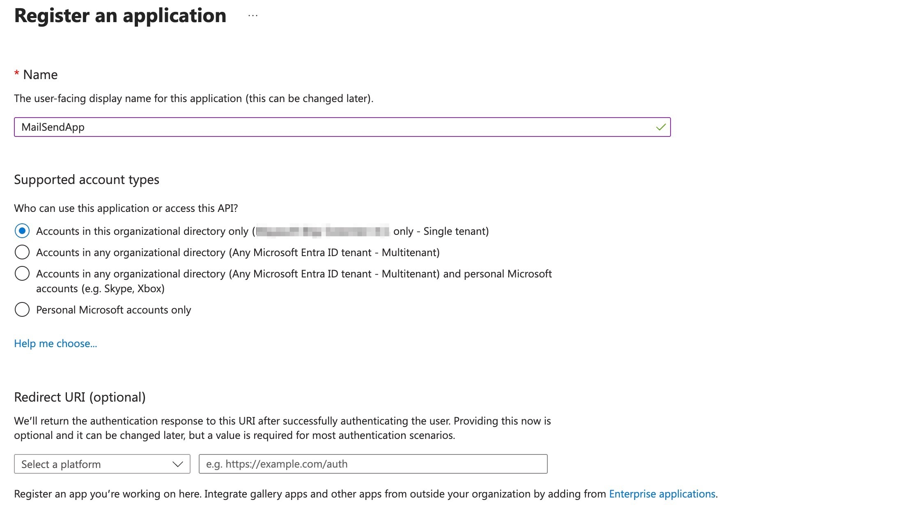
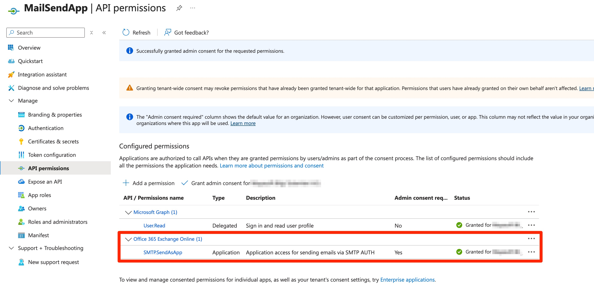
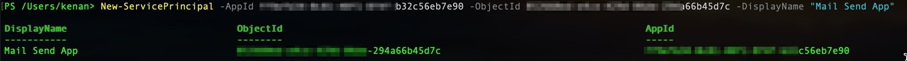

# Azure AD App Registration for Exchange Online SMTP OAuth2

This document explains how to create and configure the **Azure AD application** used in this project.  
All screenshots are anonymized and provided for demonstration purposes.

---

## 1. Create the application

1. Go to **Microsoft Entra ID → App registrations → New registration**
2. **Name:** `MailSendApp` (or any name you prefer)  
3. **Supported account types:** *Accounts in this organizational directory only*  
4. **Redirect URI:** leave blank (not needed for server-to-server auth)  
5. Click **Register**

---

**Get Application ID, Tenant ID**

## 2. Create a client secret

1. Open your app → **Certificates & secrets**
2. Click **New client secret**
3. Enter a description and choose an expiry period
4. Click **Add**
5. Copy the generated **Value** immediately — you will need it later

---

## 3. Add API permissions

1. Go to **API permissions → Add a permission**
2. Choose **Office 365 Exchange Online**
3. Select **Application permissions**
4. Find and enable **SMTP.SendAsApp**
5. Click **Add permissions**
6. Then click **Grant admin consent** for your tenant

---

## 4. Register the service principal in Exchange Online

Use Exchange Online PowerShell:

New-ServicePrincipal -AppId "<APPLICATION_CLIENT_ID>" -ObjectId "<ENTERPRISE_APP_OBJECT_ID>"

## 5. Verify SMTP AUTH is enabled for the mailbox

Get-CASMailbox -Identity "sender@yourdomain.com" | FL SmtpClientAuthenticationDisabled

If it’s disabled (True), enable it with:

Set-CASMailbox -Identity "sender@yourdomain.com" -SmtpClientAuthenticationDisabled $false

## 5. Add mailbox permission to the mailbox which we want send via

